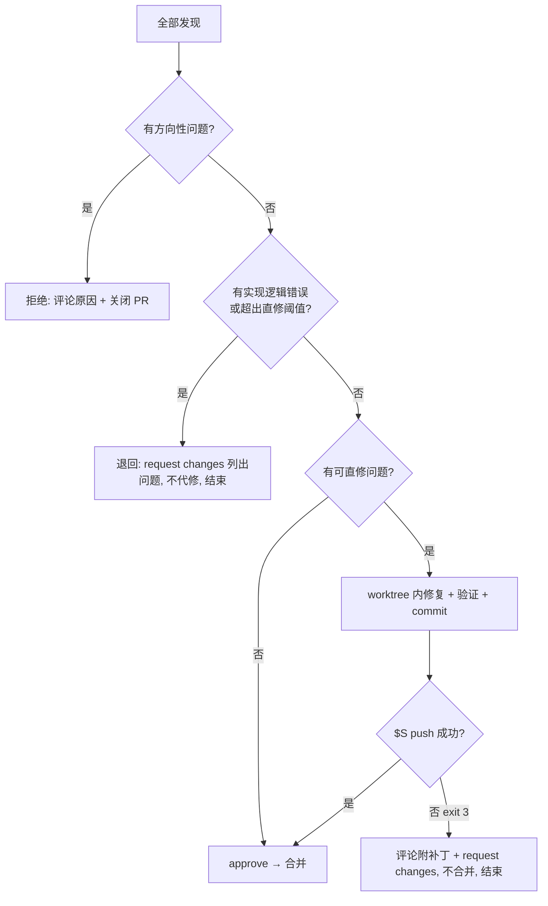

# FluxDown PR review / 补完 / 合并

助手脚本 `S=.omp/skills/pr-review/scripts/pr.sh`（仓库内任意目录可调用）：

|命令|作用|
|---|---|
|`$S info <N>`|元数据、CI 摘要、`maintainerCanModify`、可合并状态|
|`$S setup <N>`|拉取到 `.worktrees/pr-<N>`（分支 `pr-<N>`）；已存在则快进到 PR 最新头；输出改动统计、落后 main 数、**与 main 是否冲突**|
|`$S push <N> [--dry-run]`|worktree HEAD **快进**推回 PR head 分支（跨仓推到 fork）；退出码 3 = 无推送权限|
|`$S cleanup <N> [--force]`|删 worktree、本地分支、PR 引用并 prune；有未提交改动时须 `--force`|

## 0. 授权边界

用户调用本 skill 处理某个 PR，即对**该 PR** 授权以下动作，无需再逐项征询（`AGENTS.md` §6 按动作计授权，此处一次性列明）：

- 在 `.worktrees/pr-<N>` 内 commit；经 `$S push` 快进推回 PR head 分支。
- 在 PR 下发评论 / review（approve、request changes）；方向错误时关闭 PR。
- 结论为通过且门禁满足时合并（§6）。用户说「只 review」「先别合」→ 停在 approve，不合并。

永远不做：force push、推 `main`/`stable`、打 tag、`gh pr merge --admin` 绕过检查、合并 base ≠ `main` 的 PR、`--no-verify`。

## 1. 预检（不拉代码先筛）

```bash
$S info <N>
gh pr view <N> --json body,comments,reviews,closingIssuesReferences
```

- draft → 不处理，告诉用户。
- base 是 `stable` → 违反分支模型；`gh pr edit <N> --base main` 改 base 后按正常流程走（改后冲突按 §4 处理）。
- 读 PR 描述、关联 issue、已有评论与 review：**上一轮已提的意见先核对是否已处理**，不重复提。
- 作者后续又推了新提交 → 只增量审查新提交（`git log`/`git diff <上次审查的 oid>..HEAD`），但结论按全量 diff 下。

## 2. 拉取 + 不可信代码检查（执行任何构建前）

```bash
$S setup <N>
cd .worktrees/pr-<N>   # 后续 bash 调用用 cwd=".worktrees/pr-<N>"
git diff $(git merge-base origin/main HEAD) HEAD     # 全量审查 diff
```

外部贡献者的代码在本机执行 = 运行不可信代码。**先读**以下改动再决定是否构建/测试：`build.rs`、`Cargo.toml`/`Cargo.lock` 新依赖或 git/path 源、`package.json` 的 `scripts`/`postinstall`、`bun.lock`/`package-lock.json`、`.github/workflows/*`、`scripts/`、二进制文件、下载/执行外部 URL 的代码。可疑 → 不执行，按 §4「拒绝」或报告用户。

Rust 构建复用主目录 target 免全量编译：worktree 内每条 cargo 命令前缀 `CARGO_TARGET_DIR=../../target`（bash 调用间不保留环境变量；与主目录构建互斥加锁，并行 review 多个 PR 时会排队）。

## 3. 三个角度审查

每条发现记录：`path:line`、问题、依据（代码/规则/复现）、建议修法、分级（§4）。**能跑就跑**：怀疑的 bug 用针对性测试或一次性脚本复现，复现不了标 `[INFERENCE]`，不当实锤。

### 功能
- 实际行为是否等于 PR 描述与关联 issue 的诉求；有没有描述外的顺手改动（夹带 = 退回拆分）。
- 边界与错误路径：空值、超大文件 >2GB、取消/暂停/恢复、重试、并发竞态、状态码转移（见 `.omp/knowledge/engine.md`）。
- 硬不变式（`AGENTS.md` §4）：actor drain `resolve_rx`/`plugin_retry_rx`、PG 字节列 `BIGINT` + 双 schema + 迁移、子进程 `proc::no_console_window`、anyhow `{e:#}`、BT 只认哨兵、复制链接读 `origin_url`、RSS 无人值守、单写者锁、空闲静默。
- wire 兼容：protocol DTO/事件改动不破坏 GPUI、Web、原生移动端；严格事件枚举新增要升协议版本。
- 跨平台：Windows/macOS/Linux 路径、权限、编码；移动端 feature 关闭时（`plugins`/`components`）主链路零变化。

### 性能
- current_thread actor 内无阻塞 IO/长计算（应 `spawn_blocking` 或 off-actor）；锁不跨 `.await`。
- 热路径（进度事件、分段写入、GPUI render、Web 列表渲染）无多余分配、clone、整文件读入内存、O(n²)。
- 新周期任务受空闲门控或事件驱动（NAS 硬盘休眠）；事件/RPC 频率有节流。
- DB：N+1 查询、缺索引、循环内逐条事务。

### 完整性
- 测试：新行为、边界、回归有测试且能抓住真实 bug；无测源码文本 / mock 回显 / 只测不 panic 的伪测试。
- 镜像契约（`AGENTS.md` §5）逐项核对：改了一侧没改另一侧即不完整（RSS filter 三份、排序/来源构成 Web 镜像、webhook 事件名、protocol ↔ `web/src/lib/rpc/protocol`、UniFFI DTO ↔ Kotlin/Swift 等）。
- i18n：新增文案 en + zh 基线对齐（`assets/i18n/{en,zh}.json`），无硬编码文案；社区语言不碰。
- API 改动重生成 `website-v2/public/openapi.json`；架构/契约变化同步 `.omp/knowledge/*`。
- lint 红线：非测试 `unwrap`/`expect`、静默忽错、`todo!`、通配 import、新增 `unsafe`（`rule://no-unsafe-in-rust`）、用 `allow` 消音。
- 新增依赖 → 项目政策要求事先确认，交用户决定（§4）。

## 4. 分级与处置



|级别|判定（满足任一）|处置|
|---|---|---|
|**拒绝**（方向）|违反产品决策/红线：恢复已退役的 Flutter/hub 工程、改动冻结的 `native/server`、新增遥测点或采集下载信息、下载页侧栏独立「分类」分区、与既有功能重复、不该进本项目的范围；架构方向错（绕过 `fluxdown_engine`/protocol 边界、在 UI 里实现引擎逻辑）；可疑/恶意代码|`gh pr comment <N> --body-file -` 说明原因与可接受的替代方向，再 `gh pr close <N>`|
|**退回**（实现）|核心逻辑错误、需重写主体、有多种修法需作者取舍、需作者补信息（复现、平台实测）、安全问题要重设计、夹带无关改动需拆分、修复量超直修阈值|`gh pr review <N> --request-changes --body-file -`，不代修，结束 review|
|**直修**|PR 方向与主体实现确认正确，问题属机械性或局部：fmt/clippy、与 main 的冲突、缺几条测试、i18n 漏 zh/en、镜像契约漏同步、openapi 未重生成、局部边界 bug、`{e:#}`、`unwrap→?`、漏 `no_console_window`、调试残留、文档坐标|自己修，推回 PR 分支，合并|
|**建议**（nit）|风格偏好、可选优化，不影响正确性|写进评论，不阻塞合并、不代改|

**直修阈值**（全部满足才直修，否则退回）：修法唯一且确定；不改 PR 的设计、公开接口或用户可见语义（让行为符合 PR 描述的 bug 修复除外）；净改动约 ≤150 行且不超过 PR 自身改动量的 1/3（补测试可放宽，测试本身不算设计变更）。

**拿不准方向**（例如新增依赖、新功能是否符合路线图、产品取舍）→ 用 `ask` 问用户，不自行拒绝或放行。

### 直修流程

- 冲突：在 worktree 内 `git merge origin/main` 解决后提交（**禁 rebase**，rebase 需 force push）；冲突落在作者核心逻辑且需语义判断 → 退回。
- 每类修复一个 commit，遵循 `skill://commit`（Conventional Commits，中文 subject，不加 AI 署名 trailer）。
- 验证（§5）全部通过后 `$S push <N>`。退出码 3 或推送被拒 → 不再尝试其它途径，`git format-patch origin/pr/<N>..HEAD --stdout` 的内容放进评论 `<details>` 里，request changes 请作者应用。

## 5. 验证

- CI 已绿且你没改代码：不重复跑 CI 已覆盖的检查，只跑为证实疑点的针对性测试/脚本。
- 你改了代码：按改动路径跑对应命令，全部通过才推。

|改动路径|命令（cwd = worktree）|
|---|---|
|任何 Rust|`cargo fmt --check && cargo clippy --workspace --exclude fluxdown_server --all-targets -- -D warnings`|
|`native/engine`|`cargo nextest run -p fluxdown_engine <filter>`；插件相关加 `--features plugins,components`|
|`native/{api,protocol,daemon,engine_protocol,link,logfile,cli}`|`cargo nextest run -p <crate>`；API 改动跑 `gen_openapi` 后确认无漂移|
|`native/agent` / `native/mobile` / `crates/*`|`cargo nextest run -p <crate>`|
|`web/`|`cd web && bun install --frozen-lockfile && bun run lint && bun run test && bun run build`|
|`website-v2/`|`cd website-v2 && bun install --frozen-lockfile && bun run test`|
|`fluxDown/`（扩展）|`cd fluxDown && npm ci && npm run build`|
|`mobile/Android`|`AGENTS.md` §2 的 gradle 命令|
|`mobile/FluxDown`|`AGENTS.md` §2 的 FluxKit 测试与 Xcode 构建命令|

禁 `cargo test --workspace`（项目禁令）。推送后 CI 会重跑，合并前等它结束（§6）。

## 6. 合并

门禁（全部满足）：无未解决的拒绝/退回级问题；最后一次推送后的 CI 全绿（`gh pr checks <N> --watch --fail-fast`，SKIPPED 视为通过）；`$S info <N>` 显示 `mergeStateStatus=CLEAN`；base = `main`。

```bash
gh pr review <N> --approve --body-file -     # 正文写审查结论与已代修清单
gh pr merge <N> --merge                      # 仓库惯例是 merge commit（"Merge pull request #N from …"）
# 主目录在 main、工作树干净时同步本地 main；否则跳过并在汇报里说明
git fetch origin main                        # cwd = 仓库主目录
git merge --ff-only origin/main
```

## 7. 清理（任何结局都做）

合并、关闭、退回、仅评论、中途放弃——结束本 PR 处理时都执行：

```bash
$S cleanup <N>          # worktree 里有未推送的改动仍要丢弃时用 --force（先确认已以补丁形式发到评论）
```

## 8. 评论写法

- 语言跟随 PR 描述语言（英文 PR 用英文，中文 PR 用中文）。
- 结构：**结论**（approve / 已代修并合并 / 需修改 / 关闭）→ **问题**（`path:line` + 现象 + 依据 + 期望修法，按严重度排序）→ **已代修**（commit 短 hash + 一句话）→ **建议**（非阻塞）。
- 具体、可执行，引用代码行与项目规则；不客套、不重复已有 review 意见。
- 正文用 heredoc 经 `--body-file -` 传入，避免 shell 转义。

## 9. 向用户汇报

每个 PR 一行结论 + 关键发现：

|PR|结论|关键发现|已代修|验证|
|---|---|---|---|---|
|#N|合并 / 退回 / 关闭 / 待作者|最重要的 1–3 条|commit 列表或「无」|跑过的命令与结果|

多个 PR 可用 `task` 并行处理（每个 PR 独立 worktree，互不干扰）；共享 `CARGO_TARGET_DIR` 时构建会排队，CPU 紧张就各自用独立 target 或顺序处理。
