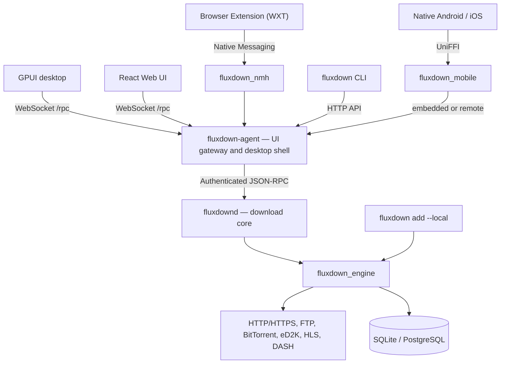

<div align="center">


# FluxDown

### Downloads, Supercharged.

*A blazing fast, multi-protocol download manager — the free & open-source IDM alternative.*

[](https://github.com/zerx-lab/FluxDown/releases/latest)
[](https://github.com/zerx-lab/FluxDown/releases)
[](LICENSE)
[](#installation)
[](native/engine)
[](crates/app)
[](mobile)
[](https://glama.ai/mcp/servers/zerx-lab/FluxDown)

[](https://github.com/rust-unofficial/awesome-rust#utilities)
[](https://github.com/thechampagne/awesome-windows#utilities)
[](https://github.com/Axorax/awesome-free-apps#download-managers)
[](https://github.com/offa/android-foss#-downloader--manager)
[](https://github.com/pcqpcq/open-source-android-apps/blob/master/categories/tools.md)
[](https://portainer-templates.as93.net/fluxdown)
[](https://github.com/selfhosters/unRAID-CA-templates/blob/master/templates/fluxdown.xml)
[](https://github.com/1c7/chinese-independent-developer)

[**Website**](https://fluxdown.zerx.dev) · [**Download**](https://fluxdown.zerx.dev/#download) · [**Changelog**](https://fluxdown.zerx.dev/changelog) · [**FAQ**](https://fluxdown.zerx.dev/faq) · [**Feedback**](https://fluxdown.zerx.dev/feedback)

**English** | [简体中文](README.zh-CN.md)

</div>

---

## Highlights

- **Dynamic download acceleration** — Rust + Tokio engine with adaptive segmentation and slow-segment rescue
- **Multi-protocol** — HTTP/HTTPS, FTP, BitTorrent, eD2K, HLS & DASH streaming
- **One engine, multiple clients** — native GPUI desktop, Kotlin Android and SwiftUI iOS apps, React Web UI and CLI
- **Browser integration** — Chrome / Edge / Firefox extension with a 3-layer interception engine, plus a userscript
- **AI-agent ready** — built-in MCP (Model Context Protocol) server: let Claude, Cursor & other AI clients manage your downloads
- **Automation & remote management** — RSS subscriptions, scheduled queues, webhooks, plugins and optional FluxCloud device collaboration
- **Local-first** — free and open source, no ads, no account required for local downloads; resumable state stored locally by default

## Features

| Feature | Description |
|---|---|
| **Rust-Powered Engine** | Shared Rust + Tokio engine, independent of UI and FFI, used by desktop, mobile, server and standalone CLI hosts |
| **Smart Segmentation** | Segments split dynamically at runtime; idle workers take over slow segments |
| **Multi-Protocol** | Dedicated engines for HTTP/HTTPS, FTP, BitTorrent (DHT/UPnP/magnet), eD2K (server + Kad DHT source finding, MD4 verification), HLS (AES-decrypt) and DASH |
| **Queues & Speed Control** | Named queues, scheduling and token-bucket global rate limiting |
| **Persistence & Resume** | SQLite with WAL by default; server deployments can use PostgreSQL; recover downloads from persisted state |
| **Browser Integration** | Download interception, streaming media sniffing, Alt+Click bypass, right-click send and connection diagnostics |
| **Desktop & Web UI** | GPUI desktop and React Web management, light/dark themes, custom themes, task details and segment visualization; desktop tray keeps the service available after the UI closes |
| **RSS & Automation** | Feed filters, unattended downloads, JavaScript plugins, managed FFmpeg/yt-dlp components and task-event webhooks |
| **Remote Devices** | Optional FluxCloud account, settings sync and remote task management, plus LAN device pairing and direct connections |
| **APIs & CLI** | REST/OpenAPI, aria2-compatible JSON-RPC, MCP with 12 tools, and a CLI for scripts or standalone downloads |

**Privacy:** local downloads do not require a FluxCloud account. Cloud features are optional. Anonymous installation and daily-active statistics are controlled by `analytics_enabled` and can be disabled; they do not collect download/task information. This is not a zero-telemetry application.

## FluxDown vs. IDM

| | FluxDown | IDM |
|---|:---:|:---:|
| Price | **Free & open source** | $24.95 + renewals |
| Open source | Yes (AGPL-3.0) | No |
| Platforms | Windows / macOS / Linux / NAS / Android | Windows only |
| BitTorrent & magnet | Yes | No |
| eD2K / eMule links | Yes | No |
| HLS / DASH streaming | Yes | Partial |
| Dynamic segmentation | Yes | Yes |
| Browser extension | Chrome / Edge / Firefox | Yes |
| Ads | **None** | — |

## Installation

Grab the latest build from [**GitHub Releases**](https://github.com/zerx-lab/FluxDown/releases/latest) or [**fluxdown.zerx.dev**](https://fluxdown.zerx.dev/#download):

| Platform | Packages |
|---|---|
| **Windows** (x64 / ARM64) | `setup.exe` installer · portable `.zip` |
| **macOS** (Intel / Apple Silicon) | `.dmg` · portable `.tar.gz` |
| **Linux** (x64) | `.AppImage` · `.deb` · Arch `.pkg.tar.zst` · portable `.tar.gz` |
| **Android** (arm64-v8a / armeabi-v7a / x86_64) | per-ABI `.apk` · universal `.apk` |
| **NAS / Server** (headless, x64 / ARM64) | [Docker](https://ghcr.io/zerx-lab/fluxdown-server) · Synology DSM 6/7 `.spk` · QNAP `.qpkg` · OpenWrt `.ipk` · Unraid CA template · CasaOS / ZimaOS app store |

### Browser Extension

Install the extension so FluxDown takes over browser downloads automatically:

[](https://chromewebstore.google.com/detail/fluxdown/meleenglfggcmcajknpeeeiobnpfmahc)
[](https://microsoftedge.microsoft.com/addons/detail/fluxdown/nglkkjbogjghekbhhcnccnpfedjbdhhd)
[](https://addons.mozilla.org/firefox/addon/fluxdown)

The extension connects to the desktop agent through Native Messaging. A [Tampermonkey userscript](userscript/) is also available.

### NAS / Server

The current headless service is **`fluxdown-agent --server` + `fluxdownd`**, with an embedded Web UI. The Docker image retains the name `ghcr.io/zerx-lab/fluxdown-server`.

From a checkout, use the supplied [Compose configuration](docker/docker-compose.yml):

```shell
docker compose -f docker/docker-compose.yml up -d
```

Open `http://<server>:17800/` and set an access key in the first-run wizard. The key must contain 8–128 visible ASCII characters, including both a letter and a digit. Set it up on a trusted network before exposing the service; use an HTTPS reverse proxy for remote access.

- Server mode listens on `0.0.0.0:17800` by default; override it with `FLUXDOWN_BIND`.
- For unattended setup, supply `FLUXDOWN_TOKEN` through your deployment environment or secret manager, not a committed file. It initializes the key only if one has not already been set.
- Persist `/data` for the database, logs and access key, and `/root/Downloads` for downloads. The supplied Compose file uses a named data volume and `docker/downloads/` on the host.
- Prefer SSD/cache storage for `/data` if download disks need to sleep.
- Native deployments must keep `fluxdown-agent` and `fluxdownd` in the same directory. The old `native/server` crate is frozen and is not the deployment entry point.

## CLI & HTTP APIs

The `fluxdown` CLI connects to the running desktop or server HTTP API by default. On desktop, enable the management API in Settings → API Service first. Supply the access key via `FLUXDOWN_TOKEN`; use `FLUXDOWN_URL` or `--url` to select a remote server.

```shell
fluxdown ping
fluxdown add "https://example.com/file.zip"
fluxdown --json list

# Standalone mode: embed the engine instead of connecting to a service
fluxdown add --local "https://example.com/file.zip"
```

Standalone mode cannot share a data directory with a running engine: stop the service using that directory first.

| Interface | Endpoint | Purpose |
|---|---|---|
| REST management API | `/api/v1/*` | Tasks, queues, RSS and other management operations |
| OpenAPI | `/api/v1/openapi.json` | Machine-readable API schema |
| aria2-compatible JSON-RPC | `/jsonrpc` (HTTP / WebSocket) | Integration with aria2-compatible clients |
| MCP | `/mcp` | AI-agent tools |
| Official UI protocol | `/rpc` (WebSocket) | GPUI/Web gateway; distinct from the aria2 API |

Desktop defaults to `127.0.0.1:17800`, with management API and MCP disabled until enabled. Server mode enables both by default and requires an access key. See the [OpenAPI specification](website-v2/public/openapi.json) for the REST contract.

## MCP Server (Model Context Protocol)

FluxDown ships a built-in **MCP server** so AI agents (Claude Desktop, Cursor, Cline, …) can manage downloads via the [Model Context Protocol](https://modelcontextprotocol.io). It implements a stateless **Streamable HTTP** subset (JSON-RPC 2.0 over `POST /mcp`) on the same API port — no separate MCP process needed.

- **Endpoint**: `http://127.0.0.1:17800/mcp` for the default desktop configuration; use your server address for headless deployments
- **Auth**: Bearer token (`Authorization: Bearer <token>` or `X-FluxDown-Token`), shared with the management API
- **Enable**: Settings → API Service → toggle *MCP endpoint* (a token is generated automatically); the headless server enables it by default

### Tools (12)

| Tool | Description |
|---|---|
| `download_add` | Create a download task (HTTP/HTTPS, FTP, magnet, BitTorrent) |
| `download_list` | List tasks with progress/speed/status, optional status filter |
| `download_get` | Get a single task by ID |
| `download_pause` / `download_resume` | Pause / resume one task |
| `download_pause_all` / `download_resume_all` | Pause / resume all tasks |
| `download_remove` | Remove a task, optionally deleting downloaded files |
| `queue_list` | List named queues and their configuration |
| `rss_list` | List RSS subscriptions with their configuration and runtime state |
| `rss_add` | Subscribe to an RSS feed and start polling it on a schedule |
| `rss_remove` | Delete an RSS subscription and the items it collected |

### Client configuration

```json
{
  "mcpServers": {
    "fluxdown": {
      "url": "http://127.0.0.1:17800/mcp",
      "headers": { "Authorization": "Bearer <your-token>" }
    }
  }
}
```

The MCP layer is implemented in [`native/api/src/mcp.rs`](native/api/src/mcp.rs) on top of the same `ApiHost` trait that powers the REST management API and aria2-compatible JSON-RPC.

## Architecture

**One Rust download engine, multiple hosts and clients.** Desktop uses `fluxdown-desktop → fluxdown-agent → fluxdownd`; headless deployments reuse the agent and daemon with a React Web UI. Native Android and iOS clients connect through UniFFI (`native/mobile`), using an embedded agent and daemon for local downloads or `/rpc` for remote hosts.



- **Daemon owns downloads:** engine, download database, queues, RSS, plugins and webhooks.
- **Agent owns integration:** UI gateway, FluxCloud account/sync, device collaboration, browser capture and desktop tray/lifecycle.
- **Shared contracts:** `native/protocol` defines transport-independent DTOs, methods and events; `native/api` exposes REST, aria2 and MCP through `ApiHost`, without depending on the engine.
- **Engine independence:** `EventSink` and `HostSelection` connect the engine to hosts. Only one engine may write to a data directory at a time; the diagram shows alternative hosts, not concurrent writers.

| Layer | Tech | Path |
|---|---|---|
| Desktop UI | Rust + GPUI; app composition and capability crates | [`crates/`](crates), [`crates/app/`](crates/app) |
| Agent / daemon | UI gateway and headless host / download core | [`native/agent/`](native/agent), [`native/daemon/`](native/daemon) |
| Shared protocol / HTTP API | JSON-RPC DTOs / REST, aria2, MCP adapters | [`native/protocol/`](native/protocol), [`native/api/`](native/api) |
| Download engine | Rust + Tokio, no UI or FFI dependencies | [`native/engine/`](native/engine) |
| Mobile UI / bridge | Kotlin + Jetpack Compose / SwiftUI + UniFFI | [`mobile/Android/`](mobile/Android), [`mobile/FluxDown/`](mobile/FluxDown), [`native/mobile/`](native/mobile) |
| Web management UI | React + TypeScript + Vite | [`web/`](web) |
| CLI | HTTP client or embedded engine | [`native/cli/`](native/cli) |
| Browser integration | WXT + TypeScript, Native Messaging, userscript | [`fluxDown/`](fluxDown), [`native/nmh/`](native/nmh), [`userscript/`](userscript) |
| Website | Astro + React; `website/` is the legacy archive | [`website-v2/`](website-v2) |

## Building from Source

Start with the [Rust toolchain](https://www.rust-lang.org/tools/install) and your platform's native build tools (MSVC on Windows, Xcode command-line tools on macOS). Linux desktop builds also need graphics, audio and tray development libraries; the maintained Ubuntu package list is in [CI](.github/workflows/ci.yml). [Bun](https://bun.sh) is needed for the Web UI. Android uses Android Studio's JBR, Android SDK/NDK and `cargo-ndk`; iOS uses Xcode.

```shell
# Clone the development branch (main = active development, stable = stable releases)
git clone -b main https://github.com/zerx-lab/FluxDown.git
cd FluxDown
```

### Desktop (GPUI)

```shell
# Build desktop UI, agent, daemon and browser relay, then launch
cargo desktop-dev

# Build only (also stages a signed development .app on macOS)
cargo desktop-dev --build-only
```

The launcher reuses an existing desktop/service instance rather than forcibly restarting it. Quit the UI and stop its services before testing changes to running code.

### Headless server & Web UI

```shell
# Build the Web UI BEFORE building the agent
cd web
bun install --frozen-lockfile
bun run build
cd ..

cargo build -p fluxdown_daemon
cargo run -p fluxdown_agent --features web-ui -- --server
```

The `web-ui` feature embeds `web/dist` into the agent binary at compile time. After changing the frontend, rebuild the Web UI and then the agent. `FLUXDOWN_WEBROOT` optionally serves a directory from disk instead.

For frontend development, run `cd web && bun run dev` in a second terminal while the server is running: Vite listens on port 5173 and proxies backend requests to port 17800.

### CLI

```shell
cargo build -p fluxdown_cli
cargo run -p fluxdown_cli -- ping
```

### Native mobile

Android lives in `mobile/Android`; iOS lives in `mobile/FluxDown`. Both use the shared Rust core in `native/mobile` and shared translations in `assets/i18n`.

```shell
# Android: use Android Studio's JBR as JAVA_HOME
(cd mobile/Android && ./gradlew :core:testDebugUnitTest :bridge:testDebugUnitTest :app:assembleDebug)
# iOS: from repository root
mobile/FluxDown/scripts/build-core.sh
(cd mobile/FluxDown && xcodebuild build -project FluxDown.xcodeproj -scheme FluxDown -destination 'generic/platform=iOS Simulator')
```

Official Android releases use the native project's `ANDROID_NATIVE_*` signing credentials. **They cannot be installed over the old Flutter APK**; back up needed data before uninstalling the old app. The retired Flutter SDK, Rinf and hub are no longer build prerequisites. Shared assets, legacy desktop data/theme upgrade compatibility and the website's legacy theme editor remain supported.

<details>
<summary><b>Running tests</b></summary>

```shell
cargo test -p fluxdown_engine        # Engine tests
cargo test -p fluxdown_api           # HTTP / aria2 / MCP contracts
cargo test -p fluxdown_agent         # Gateway / server
cargo test -p fluxdown_cli           # CLI
cd web && bun test && cd ..          # Web UI
cargo test -p fluxdown_mobile        # Shared native mobile core
```

</details>

## Contributing & Community

- **Bug reports / feature requests** — [GitHub Issues](https://github.com/zerx-lab/FluxDown/issues) or the in-app feedback dialog
- **QQ Group** — [832143651](https://fluxdown.zerx.dev/qq-group)

Pull requests are welcome! Branch off `main` and target `main` — it is the development branch, while `stable` only tracks stable releases (maintainers advance it from `main`). Before submitting, please make sure:

```shell
cargo fmt --check
cargo clippy --workspace --exclude fluxdown_server --all-targets -- -D warnings
```

See [CONTRIBUTING.md](CONTRIBUTING.md) for the full workflow.

## License

Distributed under the [GNU Affero General Public License v3.0](LICENSE).

<div align="center">

**If FluxDown saves you time, consider giving it a Star — it helps more people discover the project.**

Made by [zerx-lab](https://github.com/zerx-lab)

</div>
