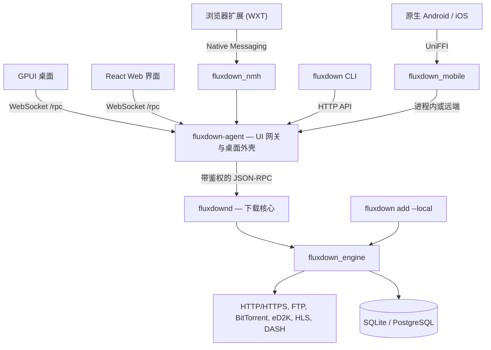

<div align="center">


# FluxDown

### 下载，全面加速。

*极速多协议下载管理器 —— 免费开源的 IDM 替代品。*

[](https://github.com/zerx-lab/FluxDown/releases/latest)
[](https://github.com/zerx-lab/FluxDown/releases)
[](LICENSE)
[](#安装)
[](native/engine)
[](crates/app)
[](mobile)
[](https://glama.ai/mcp/servers/zerx-lab/FluxDown)

[](https://github.com/rust-unofficial/awesome-rust#utilities)
[](https://github.com/thechampagne/awesome-windows#utilities)
[](https://github.com/Axorax/awesome-free-apps#download-managers)
[](https://github.com/offa/android-foss#-downloader--manager)
[](https://github.com/pcqpcq/open-source-android-apps/blob/master/categories/tools.md)
[](https://portainer-templates.as93.net/fluxdown)
[](https://github.com/selfhosters/unRAID-CA-templates/blob/master/templates/fluxdown.xml)
[](https://github.com/1c7/chinese-independent-developer)

[**官网**](https://fluxdown.zerx.dev) · [**下载**](https://fluxdown.zerx.dev/#download) · [**更新日志**](https://fluxdown.zerx.dev/changelog) · [**常见问题**](https://fluxdown.zerx.dev/faq) · [**反馈**](https://fluxdown.zerx.dev/feedback)

[English](README.md) | **简体中文**

</div>

---

## 亮点

- **动态下载加速** —— Rust + Tokio 引擎，自适应分段与慢速分段接管
- **多协议支持** —— HTTP/HTTPS、FTP、BitTorrent、eD2K、HLS 与 DASH 流媒体
- **一套引擎，多种客户端** —— 原生 GPUI 桌面、Kotlin Android 与 SwiftUI iOS 应用、React Web 管理界面与 CLI
- **浏览器集成** —— Chrome / Edge / Firefox 扩展，三层下载拦截引擎，另有用户脚本
- **AI 智能体就绪** —— 内置 MCP（Model Context Protocol）服务器，Claude、Cursor 等 AI 客户端可直接管理下载
- **自动化与远程管理** —— RSS 订阅、定时队列、Webhook、插件，以及可选的 FluxCloud 设备协同
- **本地优先** —— 免费开源、无广告，本地下载无需账号，续传状态默认保存在本地

## 功能特性

| 特性 | 说明 |
|---|---|
| **Rust 驱动引擎** | 桌面、移动端、服务器与独立 CLI 宿主共用 Rust + Tokio 引擎，不依赖 UI 或 FFI |
| **智能分段** | 运行时动态拆分分段，空闲 worker 接管慢速分段 |
| **多协议** | HTTP/HTTPS、FTP、BitTorrent（DHT/UPnP/磁力）、eD2K（服务器 + Kad DHT 找源、MD4 校验）、HLS（AES 解密）、DASH 专属引擎 |
| **队列与速度控制** | 命名队列、定时调度与 Token bucket 全局限速 |
| **持久化与续传** | 默认使用 SQLite（WAL 模式），服务器可使用 PostgreSQL；从已持久化的状态恢复下载 |
| **浏览器集成** | 下载拦截、流媒体资源嗅探、Alt+Click 绕过、右键发送与连接诊断 |
| **桌面与 Web 界面** | GPUI 桌面与 React Web 管理，深浅主题、自定义主题、任务详情与分段可视化；桌面托盘支持关闭界面后继续提供服务 |
| **RSS 与自动化** | 订阅过滤、无人值守下载、JavaScript 插件、受管 FFmpeg/yt-dlp 组件与任务事件 Webhook |
| **远程设备** | 可选的 FluxCloud 账户、设置同步与远程任务管理，以及局域网设备配对和直连 |
| **API 与 CLI** | REST/OpenAPI、aria2 兼容 JSON-RPC、含 12 个工具的 MCP，以及用于脚本或独立下载的 CLI |

**隐私说明：** 本地下载不需要 FluxCloud 账号，云功能按需使用。匿名安装和每日活跃统计受 `analytics_enabled` 设置控制，可关闭，不采集下载或任务信息；本项目并非零遥测应用。

## FluxDown vs. IDM

| | FluxDown | IDM |
|---|:---:|:---:|
| 价格 | **免费开源** | $24.95 + 续费 |
| 开源 | 是（AGPL-3.0） | 否 |
| 平台 | Windows / macOS / Linux / NAS / Android | 仅 Windows |
| BitTorrent 与磁力链 | 支持 | 不支持 |
| eD2K / eMule 链接 | 支持 | 不支持 |
| HLS / DASH 流媒体 | 支持 | 部分支持 |
| 动态分段 | 支持 | 支持 |
| 浏览器扩展 | Chrome / Edge / Firefox | 支持 |
| 广告 | **无** | — |

## 安装

从 [**GitHub Releases**](https://github.com/zerx-lab/FluxDown/releases/latest) 或 [**fluxdown.zerx.dev**](https://fluxdown.zerx.dev/#download) 获取最新版本：

| 平台 | 安装包 |
|---|---|
| **Windows**（x64 / ARM64） | `setup.exe` 安装程序 · 便携版 `.zip` |
| **macOS**（Intel / Apple Silicon） | `.dmg` · 便携版 `.tar.gz` |
| **Linux**（x64） | `.AppImage` · `.deb` · Arch `.pkg.tar.zst` · 便携版 `.tar.gz` |
| **Android**（arm64-v8a / armeabi-v7a / x86_64） | 分架构 `.apk` · 通用 `.apk` |
| **NAS / 服务器**（headless，x64 / ARM64） | [Docker](https://ghcr.io/zerx-lab/fluxdown-server) · 群晖 DSM 6/7 `.spk` · QNAP `.qpkg` · OpenWrt `.ipk` · Unraid CA 模板 · CasaOS / ZimaOS 应用商店 |

### 浏览器扩展

安装扩展后，FluxDown 会自动接管浏览器下载：

[](https://chromewebstore.google.com/detail/fluxdown/meleenglfggcmcajknpeeeiobnpfmahc)
[](https://microsoftedge.microsoft.com/addons/detail/fluxdown/nglkkjbogjghekbhhcnccnpfedjbdhhd)
[](https://addons.mozilla.org/zh-CN/firefox/addon/fluxdown)

扩展通过 Native Messaging 连接桌面 agent。另有 [Tampermonkey 用户脚本](userscript/) 可用。

### NAS / 服务器

当前无头服务使用 **`fluxdown-agent --server` + `fluxdownd`**，内嵌 Web 管理界面。Docker 镜像仍沿用 `ghcr.io/zerx-lab/fluxdown-server` 名称。

克隆仓库后，可使用自带的 [Compose 配置](docker/docker-compose.yml)：

```shell
docker compose -f docker/docker-compose.yml up -d
```

打开 `http://<服务器>:17800/`，在首次运行向导中设置访问密钥。密钥须为 8–128 个 ASCII 可见字符，同时包含字母和数字。请先在可信网络完成初始化，再对外开放服务；远程访问应使用 HTTPS 反向代理。

- server 模式默认监听 `0.0.0.0:17800`，可通过 `FLUXDOWN_BIND` 修改。
- 无人值守部署可通过部署环境或密钥管理器提供 `FLUXDOWN_TOKEN`，不要将真实密钥写进提交的文件。它仅在尚未设置密钥时初始化生效。
- 持久化 `/data`（数据库、日志、访问密钥）与 `/root/Downloads`（下载文件）。自带 Compose 配置使用命名数据卷，下载目录映射到宿主机的 `docker/downloads/`。
- 若下载盘需要休眠，建议把 `/data` 放在 SSD 或缓存池。
- 原生部署须将 `fluxdown-agent` 与 `fluxdownd` 放在同一目录。旧 `native/server` crate 已冻结，不是当前部署入口。

## CLI 与 HTTP API

`fluxdown` CLI 默认通过 HTTP API 连接正在运行的桌面端或服务器。桌面端需先在「设置 → API 服务」启用管理 API。通过 `FLUXDOWN_TOKEN` 提供访问密钥，通过 `FLUXDOWN_URL` 或 `--url` 选择远程服务器。

```shell
fluxdown ping
fluxdown add "https://example.com/file.zip"
fluxdown --json list

# 独立模式：直接内嵌引擎，不连接服务
fluxdown add --local "https://example.com/file.zip"
```

独立模式不能与正在运行的引擎共用数据目录，须先停止使用该目录的服务。

| 接口 | 端点 | 用途 |
|---|---|---|
| REST 管理 API | `/api/v1/*` | 任务、队列、RSS 等管理操作 |
| OpenAPI | `/api/v1/openapi.json` | 机器可读的 API 规范 |
| aria2 兼容 JSON-RPC | `/jsonrpc`（HTTP / WebSocket） | 接入 aria2 兼容客户端 |
| MCP | `/mcp` | AI 智能体工具 |
| 官方 UI 协议 | `/rpc`（WebSocket） | GPUI/Web 网关，与 aria2 API 不同 |

桌面端默认监听 `127.0.0.1:17800`，管理 API 与 MCP 需手动开启；server 模式默认启用两者，并要求访问密钥。REST 契约见 [OpenAPI 规范](website-v2/public/openapi.json)。

## MCP 服务器（Model Context Protocol）

FluxDown 内置 **MCP 服务器**，AI 智能体（Claude Desktop、Cursor、Cline 等）可通过 [Model Context Protocol](https://modelcontextprotocol.io) 管理下载。实现无状态 **Streamable HTTP** 子集（`POST /mcp` 上的 JSON-RPC 2.0），复用同一 API 端口，无需单独的 MCP 进程。

- **端点**：桌面默认配置为 `http://127.0.0.1:17800/mcp`；无头部署请使用服务器地址
- **鉴权**：Bearer token（`Authorization: Bearer <token>` 或 `X-FluxDown-Token`），与管理 API 共用
- **开启方式**：设置 → API 服务 → 打开 *MCP 端点*（自动生成 token）；headless 服务器默认开启

### 工具（12 个）

| 工具 | 说明 |
|---|---|
| `download_add` | 新建下载任务（HTTP/HTTPS、FTP、磁力、BitTorrent） |
| `download_list` | 列出任务（含进度/速度/状态），可按状态过滤 |
| `download_get` | 按 ID 查询单个任务 |
| `download_pause` / `download_resume` | 暂停 / 恢复单个任务 |
| `download_pause_all` / `download_resume_all` | 暂停 / 恢复全部任务 |
| `download_remove` | 删除任务，可选同时删除磁盘文件 |
| `queue_list` | 列出命名队列及其配置 |
| `rss_list` | 列出 RSS 订阅及其配置与运行态 |
| `rss_add` | 新增 RSS 订阅并开始定期抓取 |
| `rss_remove` | 删除 RSS 订阅及其已收集条目 |

### 客户端配置

```json
{
  "mcpServers": {
    "fluxdown": {
      "url": "http://127.0.0.1:17800/mcp",
      "headers": { "Authorization": "Bearer <your-token>" }
    }
  }
}
```

MCP 层实现在 [`native/api/src/mcp.rs`](native/api/src/mcp.rs)，与 REST 管理 API、aria2 兼容 JSON-RPC 共用同一个 `ApiHost` trait。

## 架构

**一套 Rust 下载引擎，多个宿主与客户端。** 桌面链路为 `fluxdown-desktop → fluxdown-agent → fluxdownd`；无头部署复用 agent 与 daemon，提供 React Web 管理界面。原生 Android/iOS 经 UniFFI（`native/mobile`）接入，本机下载复用进程内 agent + daemon，远端主机走 `/rpc`。



- **daemon 拥有下载事实：** 引擎、下载数据库、队列、RSS、插件与 Webhook。
- **agent 负责外部集成：** UI 网关、FluxCloud 账户与同步、设备协同、浏览器捕获、桌面托盘与生命周期管理。
- **共用协议契约：** `native/protocol` 定义传输无关的 DTO、方法与事件；`native/api` 通过 `ApiHost` 提供 REST、aria2 与 MCP，不依赖引擎。
- **引擎独立：** 通过 `EventSink` 与 `HostSelection` 对接宿主。同一数据目录只允许一个引擎写入；图中展示可选宿主，并非多个宿主同时写同一数据库。

| 层 | 技术栈 | 目录 |
|---|---|---|
| 桌面 UI | Rust + GPUI；应用组装与功能 crate | [`crates/`](crates)、[`crates/app/`](crates/app) |
| agent / daemon | UI 网关与无头宿主 / 下载核心 | [`native/agent/`](native/agent)、[`native/daemon/`](native/daemon) |
| 共用协议 / HTTP API | JSON-RPC DTO / REST、aria2、MCP 适配 | [`native/protocol/`](native/protocol)、[`native/api/`](native/api) |
| 下载引擎 | Rust + Tokio，不依赖 UI 或 FFI | [`native/engine/`](native/engine) |
| 移动 UI / 桥接 | Kotlin + Jetpack Compose / SwiftUI + UniFFI | [`mobile/Android/`](mobile/Android)、[`mobile/FluxDown/`](mobile/FluxDown)、[`native/mobile/`](native/mobile) |
| Web 管理界面 | React + TypeScript + Vite | [`web/`](web) |
| CLI | HTTP 客户端或内嵌引擎 | [`native/cli/`](native/cli) |
| 浏览器集成 | WXT + TypeScript、Native Messaging、用户脚本 | [`fluxDown/`](fluxDown)、[`native/nmh/`](native/nmh)、[`userscript/`](userscript) |
| 官网 | Astro + React；`website/` 为旧站存档 | [`website-v2/`](website-v2) |

## 从源码构建

首先安装 [Rust 工具链](https://www.rust-lang.org/tools/install) 与平台原生构建工具（Windows 使用 MSVC，macOS 使用 Xcode 命令行工具）。Linux 桌面构建还需要图形、音频与托盘开发库，维护中的 Ubuntu 依赖列表见 [CI 配置](.github/workflows/ci.yml)。Web UI 需要 [Bun](https://bun.sh)；Android 使用 Android Studio 的 JBR、Android SDK/NDK 与 `cargo-ndk`，iOS 使用 Xcode。

```shell
# 克隆开发分支（main = 日常开发，stable = 稳定版本）
git clone -b main https://github.com/zerx-lab/FluxDown.git
cd FluxDown
```

### 桌面端（GPUI）

```shell
# 构建桌面 UI、agent、daemon 与浏览器中继并启动
cargo desktop-dev

# 仅构建（macOS 还会组装并签名开发用 .app）
cargo desktop-dev --build-only
```

启动器会复用已运行的桌面或服务实例，不会强制重启。验证运行中代码的修改前，请退出 UI 并停止对应服务。

### 无头服务器与 Web UI

```shell
# 必须先构建 Web UI，再构建 agent
cd web
bun install --frozen-lockfile
bun run build
cd ..

cargo build -p fluxdown_daemon
cargo run -p fluxdown_agent --features web-ui -- --server
```

`web-ui` feature 会在编译期把 `web/dist` 内嵌到 agent 二进制。修改前端后须重新构建 Web UI，再重新编译 agent；也可通过 `FLUXDOWN_WEBROOT` 改为托管磁盘目录。

前端开发时，保持服务器运行，在另一终端执行 `cd web && bun run dev`：Vite 监听 5173 端口，将后端请求代理到 17800。

### CLI

```shell
cargo build -p fluxdown_cli
cargo run -p fluxdown_cli -- ping
```

### 原生移动端

Android 工程在 `mobile/Android`，iOS 工程在 `mobile/FluxDown`；共同使用 `native/mobile` 的 Rust 核心与 `assets/i18n` 共享翻译。

```shell
# Android：JAVA_HOME 指向 Android Studio 自带 JBR
(cd mobile/Android && ./gradlew :core:testDebugUnitTest :bridge:testDebugUnitTest :app:assembleDebug)
# iOS：从仓库根目录执行
mobile/FluxDown/scripts/build-core.sh
(cd mobile/FluxDown && xcodebuild build -project FluxDown.xcodeproj -scheme FluxDown -destination 'generic/platform=iOS Simulator')
```

Android 正式发布使用原生工程的 `ANDROID_NATIVE_*` 签名，**不能覆盖安装旧 Flutter APK**；卸载旧应用前请先备份需要的数据。旧 Flutter SDK、Rinf 与 hub 不再是构建依赖。共享 assets、PC/Web 现有旧数据与主题升级兼容、官网旧主题编辑器继续保留。

<details>
<summary><b>运行测试</b></summary>

```shell
cargo test -p fluxdown_engine        # 引擎测试
cargo test -p fluxdown_api           # HTTP / aria2 / MCP 契约
cargo test -p fluxdown_agent         # 网关 / 服务器
cargo test -p fluxdown_cli           # CLI
cd web && bun test && cd ..          # Web UI
cargo test -p fluxdown_mobile        # 原生移动端共享核心
```

</details>

## 参与贡献与社区

- **Bug 反馈 / 功能建议** —— [GitHub Issues](https://github.com/zerx-lab/FluxDown/issues) 或应用内反馈对话框
- **QQ 群** —— [832143651](https://fluxdown.zerx.dev/qq-group)

欢迎提交 Pull Request！请从 `main` 拉分支并把 PR 提到 `main` —— `main` 是开发分支，`stable` 只承载稳定版本（由维护者从 `main` 合并前进）。提交前请确保通过：

```shell
cargo fmt --check
cargo clippy --workspace --exclude fluxdown_server --all-targets -- -D warnings
```

完整流程见 [CONTRIBUTING.md](CONTRIBUTING.md)。

## 许可证

基于 [GNU Affero General Public License v3.0](LICENSE) 分发。

<div align="center">

**如果 FluxDown 帮你省下了时间，欢迎点个 Star —— 让更多人发现这个项目。**

Made by [zerx-lab](https://github.com/zerx-lab)

</div>
